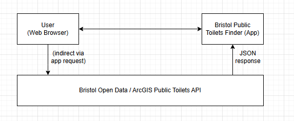

# Bristol Public Toilets Finder — Planning

## Introduction
This project is a small web app made with HTML, CSS and JavaScript that uses Bristol's Open Data Public Toilets dataset. Basically, it shows people where the public toilets are around the city, whether they're wheelchair accessible or have baby-changing facilities, and what hours they're open all pulled live from Bristol City Council's ArcGIS Open Data API.

## Problem statement
Finding a public toilet in Bristol that's open and accessible is more annoying than it should be. The council does publish all this data; name, address, area, opening hours, accessibility, baby-change facilities as part of their Open Data service, but there's no simple tool that takes that feed and turns it into something you can just check on your phone while you're out and about. This mostly affects people with mobility needs, parents with young kids, and visitors who don't know the city, since none of them can easily filter for the specific facilities they need. Sommerville (2016) makes the point that a clear problem statement based on real stakeholder needs is exactly what the planning stage of the SDLC is supposed to produce, which is basically what I'm trying to do here. This project fixes that gap with a simple client-side web app that fetches, filters and shows the live dataset.

## Business benefits
- Gives residents and visitors a quick way to find the nearest open toilet.
- Let's people filter for wheelchair-accessible or baby-changing facilities specifically the council's dataset already has this info, but no public tool currently shows it.
- Takes an Open Data resource that already exists and turns it into something people can use (Bristol City Council, 2024).
- Costs nothing to run since it's just static HTML/CSS/JS no backend, no accounts.
- Helps me build practical skills in REST API integration, responsive UI design and version control.

## Options Considered
- Use Bristol City Council's dataset page — the data's technically public, but it's shown as a table/map made for GIS users, not something you would quickly check on the go.
- General map apps — sometimes show toilets as points of interest, but coverage in Bristol is patchy and there's no way to filter for accessibility or baby-changing.
- Toilet-finder apps — a solid tool nationally, but it's not built on Bristol's own live feed, so you can't be sure the data's fresh or accurate locally.

| Option | Live council data | Free / no account | Filters by accessibility | Decision |
| --- | --- | --- | --- | --- |
| Council dataset page (raw data) | Yes | Yes | No | Rejected – not made for quick public use |
| Google Maps | No | Yes | No | Rejected – inconsistent, no accessibility filter |
| Great British Toilet Map | Partially | Yes | Yes | Rejected – not built on Bristol's own feed |
| Bristol Public Toilets Finder (this project) | Yes | Yes | Yes | Selected |

## Expected Risks

| ID | Risk | Likelihood | Impact | Mitigation |
| --- | --- | --- | --- | --- |
| R1 | ArcGIS Open Data API goes down or changes its schema | Low | High | Save the last successful data in the browser (localStorage) and show a "last updated" or "cached" label, so the app still works even if it can't reach the API. |
| R2 | Scope creep beyond what's realistic for this module | Medium | Medium | Stick to the scope in this doc and check my progress each week against the five SDLC stages. |
| R3 | Some records have missing or inconsistent fields | Medium | Low | If a field's missing, just show "Not given" instead of leaving it blank or breaking. |
| R4 | Layout looks different across browsers/devices | Medium | Low | Use responsive CSS (Flexbox/Grid) and test it on a couple of browsers plus a phone screen. |
| R5 | If the UI itself isn't accessible, that undermines the whole point of the app | Medium | Medium | Use good colour contrast and proper semantic HTML5 right from the start. |

**Return on investment:** this project doesn't make any money but it turns an existing public data asset into something genuinely usable at basically zero running cost, while also helping me build API integration, front-end and version-control skills.

## Project Scope

**In scope**
- Fetching live public toilet data from the Bristol Open Data / ArcGIS API
- Showing each toilet's name, address, area, opening hours, accessibility and baby-change status
- Filtering results by area and by accessibility need
- Manual refresh of data, with a visible "last updated" indicator
- Falling back to cached data with a clear error message if the API's unreachable
- Responsive layout that works on desktop and mobile

**Out of scope**
- Turn-by-turn navigation or an interactive map
- User accounts, ratings or reviews
- Reporting faults/issues back to the council
- Offline-first / installable app behaviour

## Context Diagram

The context diagram shows the system I'm building, Bristol Public Toilets Finder, as one process sitting between two external entities: the User, who uses the app through a normal web browser, and the Bristol Open Data / ArcGIS Public Toilets API, which is run by Bristol City Council and supplies toilet records as JSON. The app asks the API for data on load and whenever it's refreshed; the API sends back JSON; the app turns that into HTML for the user to see; and whatever the user does — filtering, refreshing — feeds back into the app, which then re-queries or re-filters as needed. There aren't any other external systems involved, which keeps the scope realistic for what a small client-side app can actually deliver in the time I've got for this module.

## Summary
This stage covered the problem I'm solving, the alternatives I looked at, the risks and how I'm planning to handle them, and the scope of the system — all based around the real Bristol Open Data Public Toilets dataset. Next up is the Requirements stage, where this gets turned into user stories, actors, use cases and a proper spec.
