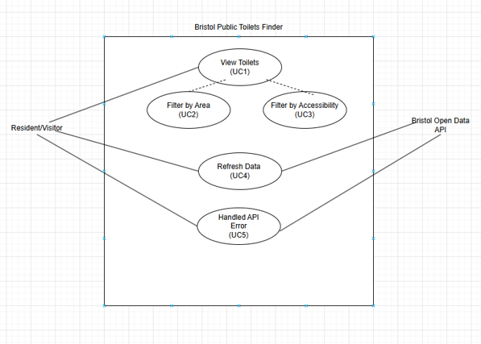

# Requirements

## Introduction
This stage is about figuring out what the app actually needs to do how users will use it and what should happen when stuff goes wrong. The point is to nail this down before writing any code.

## User stories
- As a resident, I want to see all public toilets in Bristol so I can find one nearby. (UC1)
- As a wheelchair user, I want to filter for accessible toilets so I only see the ones I can actually use. (UC3)
- As a parent, I want to filter for toilets with baby-changing facilities so I can plan a route with my kid. (UC3)
- As a visitor, I want to filter by area so I can find toilets close to where I'm staying. (UC2)
- As a user, I want to refresh the data so I'm seeing the most up-to-date opening hours. (UC4)
- As a user, I want to be told clearly if the live data can't load, so I'm not stuck relying on outdated info. (UC5)
- As a mobile user, I want the site to work properly on a small screen so I can check it while I'm out.

## Actors
- **Resident / Visitor (User)** — the main actor; anyone opening the app to find a toilet in Bristol.
- **Bristol Open Data API** — secondary actor; the external ArcGIS system that gives back toilet records when asked.

## Use Cases
Each use case has its own ID and follows the standard use-case template.

### UC1 — View Toilets
| Field | Detail |
| --- | --- |
| Description | User wants to see the current toilet info for Bristol. Source: user story 1. |
| Actors | User, Bristol Open Data API |
| Assumptions | User's got an internet connection and is using a supported browser. |
| Steps | 1. User opens the app. 2. App asks the Bristol Open Data API for data. 3. API sends back JSON. 4. App reads it and shows name, address, area, hours, accessibility and baby-change status in a table. |
| Variations | On first load, no filters are on and every toilet shows up. |
| Non-functional | NFR1, NFR3, NFR6 |
| Issues | None right now. |

### UC2 — Filter by Area
| Field | Detail |
| --- | --- |
| Description | User wants to narrow the list down to one area. Source: user story 4. |
| Actors | User |
| Assumptions | Toilet data's already loaded (includes UC1). |
| Steps | 1. User picks an area from the dropdown. 2. App filters the list to that area. 3. Table updates without reloading the whole page. |
| Variations | Picking "All Areas" clears the filter. |
| Non-functional | NFR2 |
| Issues | Area names depend on however the council's labelled LOCALITY in the source data. |

### UC3 — Filter by Accessibility
| Field | Detail |
| --- | --- |
| Description | User wants to only see toilets that match an accessibility need. Source: user stories 2–3. |
| Actors | User |
| Assumptions | Toilet data's already loaded (includes UC1). |
| Steps | 1. User picks "Wheelchair Accessible" or "Baby Changing Available" from the dropdown. 2. App filters the list accordingly. 3. Table updates without reloading. |
| Variations | Area and accessibility filters can be used together. |
| Non-functional | NFR2 |
| Issues | Some records leave DISABLED/BABY_CHANGE blank instead of "N" — these get treated as "No" rather than "unknown". |

### UC4 — Refresh Data
| Field | Detail |
| --- | --- |
| Description | User wants the latest data without reloading the whole page. Source: user story 5. |
| Actors | User, Bristol Open Data API |
| Assumptions | App's already done its first load (includes UC1). |
| Steps | 1. User clicks "Refresh Data". 2. App asks the API for data again. 3. App re-renders the table and updates the "last updated" timestamp. |
| Variations | If the request fails, it goes to UC5 (Handle API Error). |
| Non-functional | NFR1, NFR4 |
| Issues | None right now. |

### UC5 — Handle API Error
| Field | Detail |
| --- | --- |
| Description | The app needs to tell the user clearly if it can't get live data. Source: user story 6. |
| Actors | User, Bristol Open Data API |
| Assumptions | Triggered whenever a request from UC1 or UC4 fails. |
| Steps | 1. App tries to request data from the API. 2. Request fails or gets blocked. 3. App shows a visible error message and if there's cached data, shows that too with its saved timestamp. |
| Variations | If there's no cached data, the table's cleared and only the error message shows. |
| Non-functional | NFR4 |
| Issues | Haven't tuned the exact timeout yet — currently just using the browser's default fetch timeout. |

## UML Use Case Diagram

The Resident/Visitor is the main actor triggering all five use cases, and the Bristol Open Data API comes in as a secondary actor for Refresh Data and Handle API Error. Filter by Area and Filter by Accessibility both include View Toilets, since they're just filtering data that's already been pulled and shown by that base use case.

## Software Requirements Specification

### Functional requirements
| ID | Requirement | Source |
| --- | --- | --- |
| FR1 | The system shall get public toilet data from the Bristol Open Data / ArcGIS API. | UC1 |
| FR2 | The system shall show each toilet's name, address, area, opening hours, accessibility and baby-change status. | UC1 |
| FR3 | The system shall let the user filter the toilets by area. | UC2 |
| FR4 | The system shall let the user filter the toilets by accessibility (wheelchair or baby-change). | UC3 |
| FR5 | The system shall let the user manually refresh the data. | UC4 |
| FR6 | The system shall show a clear error message and fall back to cached data if the API request fails. | UC5 |
| FR7 | The system shall use valid, semantic HTML5 that passes the W3C validator. | UC1 |

### Non-Functional Requirements
| ID | Quality attribute | Requirement | Source |
| --- | --- | --- | --- |
| NFR1 | Efficiency | The system shall load and refresh toilet data within 3 seconds on a normal broadband connection. | UC1, UC4 |
| NFR2 | Usability | A first-time user should be able to use a filter without needing instructions, following Nielsen's (1994) heuristic about visibility of system status and user control. | UC2, UC3 |
| NFR3 | Portability | The layout should adapt properly to both desktop and mobile using responsive CSS. | UC1 |
| NFR4 | Reliability | The system shouldn't crash or show a blank page if the API's down — it should show a fallback error state with cached data instead. | UC4, UC5 |
| NFR5 | Maintainability | The JavaScript should be broken into small, named functions with comments, so it's easier to build on later. | UC1–UC5 |
| NFR6 | Usability (accessibility) | Text and background colours should meet WCAG AA contrast ratios — this matters even more here since the app's whole subject is accessibility. | UC1 |

## Summary
This stage covered the actors, user stories and five use cases that define how the system should behave, and turned them into a traceable set of functional and non-functional requirements. Next up is Design, where these requirements become wireframes, a wireflow and a high-fidelity mock-up.
