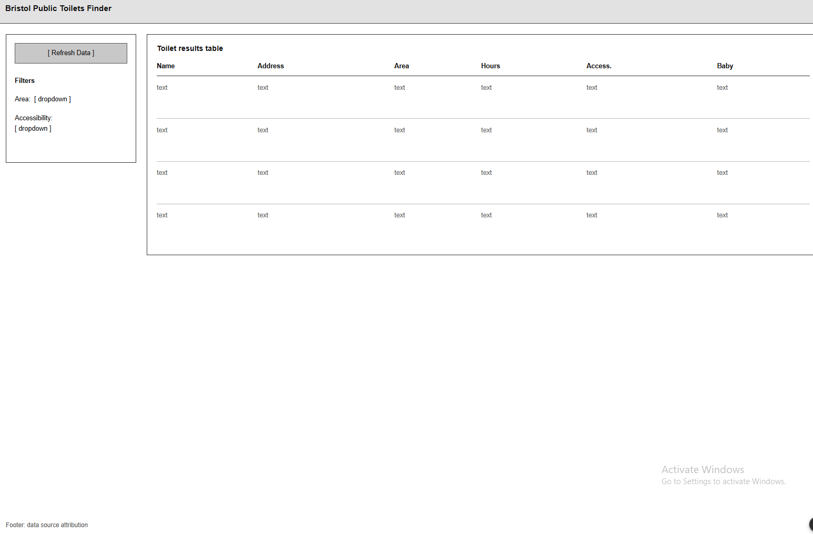
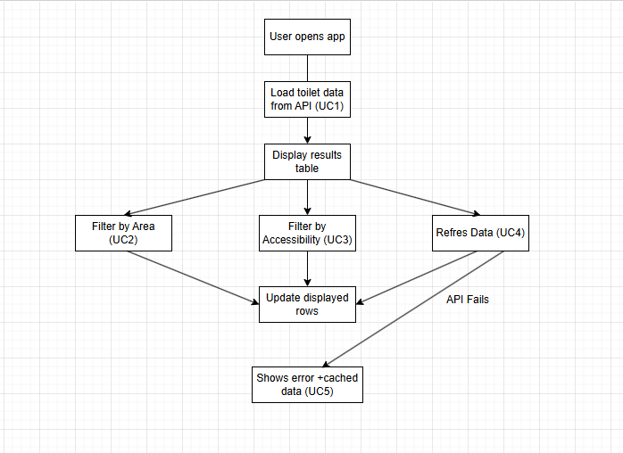
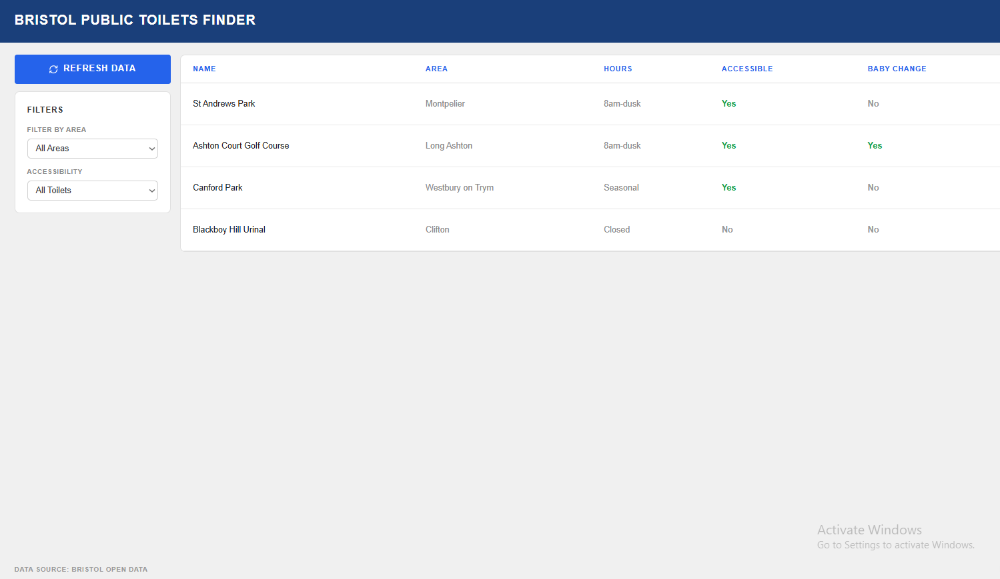

# Design

## Introduction
This stage is about designing how Bristol Public Toilets Finder looks and how people actually use it. My main goal was a clear, single-page interface that lets someone find a decent toilet in a few seconds, since that's the realistic situation it'll be used in — walking around the city, maybe with a kid or a mobility need.

## User Interface layout
The app uses a single-page, two-column layout:
- **Header** — the app title ("Bristol Public Toilets Finder").
- **Left sidebar** — a "Refresh Data" button sitting above a filter panel with two dropdowns: Area and Accessibility. I put refresh above the filters so it's always reachable without scrolling, which directly supports UC4.
- **Main panel** — a results table showing Name, Address, Area, Opening Hours, Accessible and Baby Change, with clear Yes/No badges (colour-coded green/grey) so you can tell the status at a glance.
- **Footer** — credit for the data source.

Keeping the controls (UC2, UC3, UC4) visually separate from the results they affect (UC1) means users are less likely to lose track of what's actually being shown right now — which ties directly into the usability concern behind NFR2.

The wireframe walks through the View Toilets scenario (UC1): on load, the header, refresh button, empty filter panel and populated table are all visible at once, so there's no extra navigation needed to complete the main task.

The wireflow shows how the rest of the use cases play out on the same screen: opening the app kicks off the first data load (UC1); picking a filter updates the table in place (UC2/UC3, both looping back into "Update displayed rows" instead of going to a new screen); Refresh Data (UC4) just re-triggers the same load. If that load fails, the flow branches off (shown as a dashed red line) into Handle API Error (UC5), which swaps the table out for an error message plus whatever cached data is available.

The high-fidelity mock-up uses a two-column layout: a fixed-width filter sidebar and a flexible results area, which stacks into a single column on narrow screens to meet NFR3. Colour's used functionally here — a blue accent marks the main Refresh button and the headings, and accessibility status uses green for "Yes" so it's easy to scan quickly, which makes sense given that filtering for accessibility is basically the whole point of the app (UC3). Text uses a plain sans-serif font at sizes and contrast levels aimed at meeting WCAG AA (NFR6), and there's decent spacing between rows to keep the table usable on touch screens.

## Colour and typography
I went with a white background and a dark blue for headings and the main action button, which gives strong contrast against the white content cards. Body text uses the system's default sans-serif font (Segoe UI / Arial) for readability and so it loads fast (no external font requests needed). "Yes" values use a readable green rather than a bright, saturated one, to keep the contrast against white within guidelines.

## Responsive design
The main layout uses CSS Grid with two columns, which collapses down to a single column under 700px width using a media query — so on a phone, the filter panel stacks above the results table instead of getting squashed next to it. On really small screens, the results table just scrolls horizontally inside its own container rather than breaking the whole page layout.

## Summary
This stage took the requirements from the Requirements section and turned them into an actual interface: a wireframe covering the base scenario, a wireflow covering all five use cases including the error path, and a high-fidelity mock-up that set out the grid layout, colours and typography, which then got built out in Implementation.
