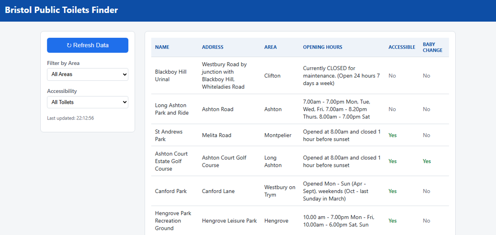
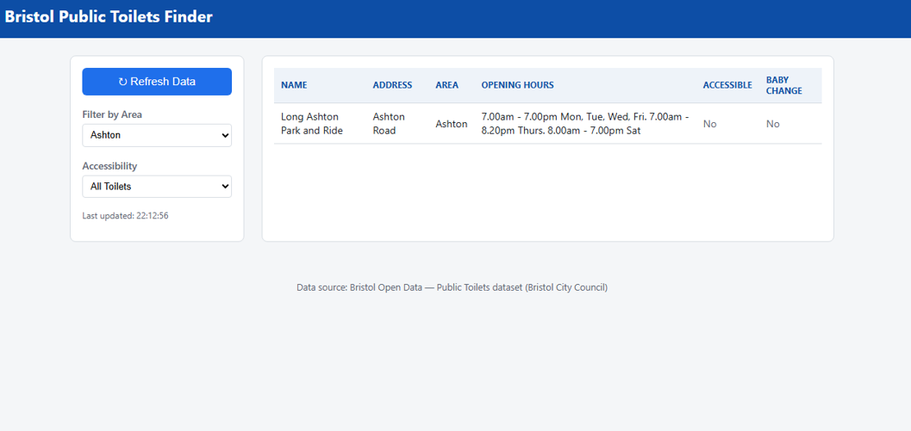
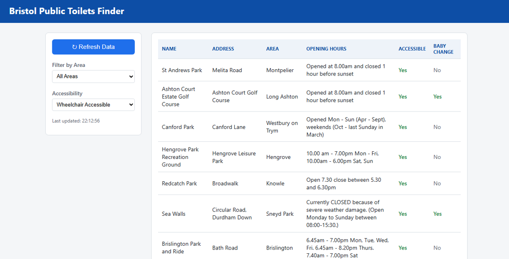
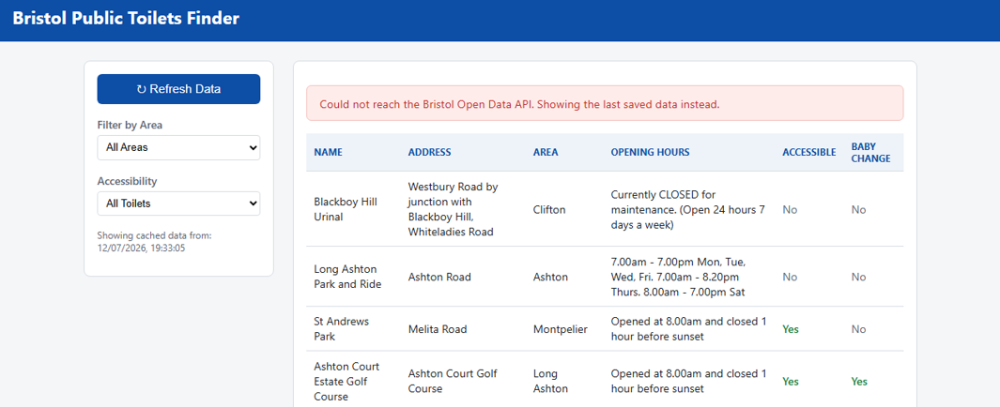

# Testing

## Introduction
This stage checks the implementation against the functional and non-functional requirements from the Requirements section, using manual testing in a real browser against the live Bristol Open Data API.

## Test cases
| ID | Requirement | Test | Steps | Expected result | Actual result | Status |
| --- | --- | --- | --- | --- | --- | --- |
| T1 | FR1, FR2 | Initial data load | Open `index.html` in a browser | Table fills up with live toilet records (name, address, area, hours, accessible, baby change) | Table populated with 14 records from the live API | Pass |
| T2 | FR3 | Filter by area | Select "Ashton" from the Area dropdown | Only toilets in Ashton show up | Table showed exactly 1 matching record | Pass |
| T3 | FR4 | Filter by accessibility | Select "Wheelchair Accessible" | Only toilets with DISABLED = Y show up | Table filtered down to accessible toilets only | Pass |
| T4 | FR5 | Refresh data | Click "Refresh Data" with a working connection | Data re-fetches and the "Last updated" timestamp changes | Timestamp updated after each click | Pass |
| T5 | FR6, NFR4 | API failure fallback | Block the API endpoint, then click "Refresh Data" | Error banner shows up; last cached data displays with a "Showing cached data from…" timestamp | Error banner and cached data both showed up correctly | Pass |
| T6 | NFR2 | Filter usability | Apply a filter without reading any instructions | Filter takes effect straight away, no reload | Table updated in place with no full page reload | Pass |

## Evidence

### T1 — Initial data load

### T2 — Filter by area

### T3 — Filter by accessibility

### T5 — API failure fallback

## Known limitations
- Testing was manual rather than automated (no unit-test framework), which is fine for the scope of this module but wouldn't scale if this was a bigger system (see NFR5 in Requirements).
- The API-failure test (T5) was done by blocking the network request myself rather than waiting for a genuine outage, since the live API's normally up and running.
- FR7 (HTML validity) and NFR3 (responsive layout) were checked during development but are not included as formal test cases here.

## Summary
All six test cases passed, including a real simulated API failure that correctly triggered the cached-data fallback (UC5). This closes the loop from Planning all the way through to a working, tested app built on the Bristol Open Data Public Toilets dataset.
